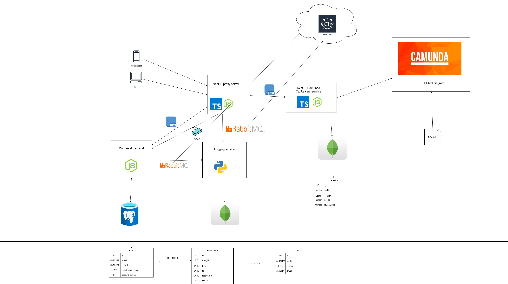

# exam

Camunda
https://github.com/Mano-el-Mano/Camunda-Service

Backend
https://github.com/Mano-el-Mano/Backend

Facade
https://github.com/Mano-el-Mano/si-facade

Logger
https://github.com/Mano-el-Mano/Rabbitmq-logger


***

This is our Exam Project addressing the Car-Rental shop made by Kristoffer and Jonas. 

Customer requirements:

```
Here at Kristoffer's Cadillac service business is bomming! 
We want to replace our legacy car rental system we a newer and more scalable application, so we can start renting out more cars. 
We have a hard time orchestrating car reservations, customer reviews, business process and logging in our legacy system. It is an older system built with a Cobol mainframe. 

We have some technical things that we would like you to consider:

- We would like a system (like a BPMN modelling service) to enforce business rules. Currently we only have a simple rule, but we want to have a simple interface, where we can scale multiple events, and add more business processing. 

- We would like to have an asynchronous protocol for controlling our logs. We plan to have logs comming in from multiple services, and we plan to add more services as stakeholders and product owners add start to add more feature requirements. 

- We would like to store our data in both a relation data store (SQL based) and an object based data store (NoSQL). We have relational data inbetween our customers and cars, while we have object based data for our logs

```


According to the requirements from the customer we have tried to implement an application that matches the requirement of the user. 

Below is an illustration of the architechture, that we have chosen for our application.



All functionality is exposed through a proxy service written in Nest.js. This provides a single entrypoint for all external clients, that wants to interact with our system. Alternatively we could have used a tool like an API Gateway or an ALB (Application Load Balancer) through a cloud hosting service like AWS. For scalability purposes this would also have some advantages in terms of making the application scalable. 

The proxy server is also responsible for creating logs to our Python Logging server. This is done using the AMQP protocol using RabbitMQ as the messaging protocol which is an asyncrhonous protocol in contrast to HTTP or RMI, which by default is a synchronous protocol. This makes our logging service more scalable as requests can come in form multiple services and systems without blocking the entire service/system. For this implementation we have used a single exchange of the type `fanout` with a single queue named `logs`. The fanout exchange type means, that the exchange sends a message to all the queue's that it knows about. 

We could alternatively have added multiple consumers to consumer different logs based on the type of log. Since the logs are added in MongoDB, we do not care about ACID compliance and we can simply write multiple logs to the same time without an issue. 

One way to achieve this is to use the `direct` or `topic` type of exchange. Using the direct type we could have a `binding key` for each of our queues and then send each message with a `routing key` to match specific messages to specific queues. This would be preferable in a scenario where we also used RabbitMQ for other purposes than logging, but based on the scope of this project we have decided to use a single fanout exchange.

We have also used BPMN to create a single business rule for our reviews. 


